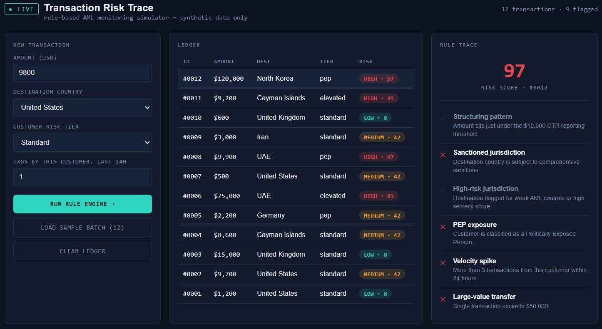
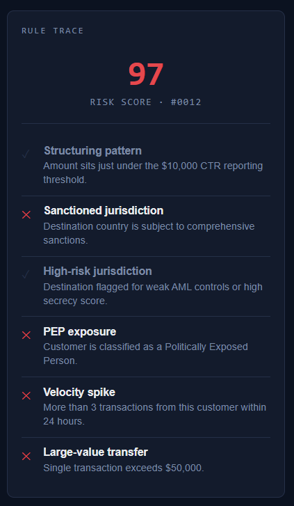
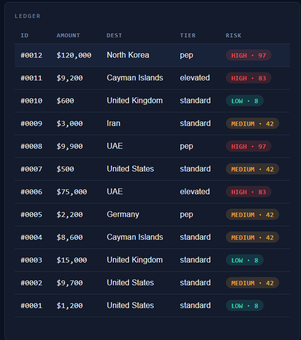

# 🚨 Transaction Risk Trace

> **A rule-based Anti-Money Laundering (AML) transaction monitoring simulator built using HTML, CSS, and JavaScript.**

Transaction Risk Trace demonstrates how financial institutions evaluate transactions using deterministic compliance rules and generate an explainable audit trail for every risk decision.

This project is built for learning and portfolio purposes using **synthetic transaction data**.

---

# 📸 Preview

---

# 🌐 Live Demo

🔗 **Live Demo:** https://soumyafernandez.github.io/transaction-risk-trace/

---

# ✨ Features

- ✅ Rule-based AML Monitoring
- ✅ Real-time Risk Scoring
- ✅ Explainable Rule Trace
- ✅ Interactive Transaction Ledger
- ✅ Sample Transaction Generator
- ✅ Synthetic AML Dataset

---

# 🛡️ AML Rules Implemented

| Rule | Description |
|------|-------------|
| Structuring Detection | Flags transactions just below the \$10,000 reporting threshold |
| Sanction Screening | Detects sanctioned jurisdictions |
| High-Risk Jurisdiction | Flags countries with elevated AML risk |
| PEP Detection | Identifies Politically Exposed Persons |
| Velocity Monitoring | Detects excessive customer transaction frequency |
| Large Value Transfer | Flags transfers above \$50,000 |

---

# 📊 Risk Levels

| Score | Risk |
|------:|------|
| 8 | 🟢 Low |
| 42 | 🟡 Medium |
| 83–97 | 🔴 High |

The simulator evaluates multiple compliance rules simultaneously and combines them into a transparent risk score.

---

# 🖼️ Screenshots

## Dashboard

---

## Rule Trace

---

## Transaction Ledger

---

# ⚙️ Tech Stack

- HTML5
- CSS3
- JavaScript (Vanilla)

---

# 🚀 How It Works

1. Enter transaction details.
2. Run the AML Rule Engine.
3. Evaluate six compliance rules.
4. Generate a risk score.
5. Display an explainable audit trail.

---

# 🔮 Future Improvements

- Customer Profiles
- Historical Transaction Analysis
- Machine Learning Risk Prediction
- Case Management Dashboard
- SAR Report Generator
- Interactive Analytics Dashboard
- Export to CSV/PDF
- Search & Filter Transactions
- Responsive Mobile UI

---

# ⚠️ Disclaimer

This application is **for educational and portfolio purposes only**.

It is **not intended for production compliance use**.

All transaction data used in this simulator is synthetic.

---

# 👨‍💻 Author

**Soumya Fernandez**

Aspiring Data Analyst | Risk Analyst | RegTech Enthusiast

- GitHub: https://github.com/soumyafernandez
- LinkedIn: https://www.linkedin.com/in/soumya-fernandez/

---
